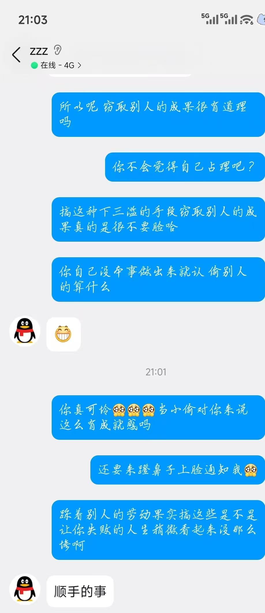
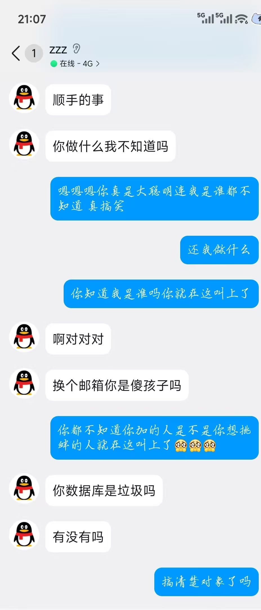
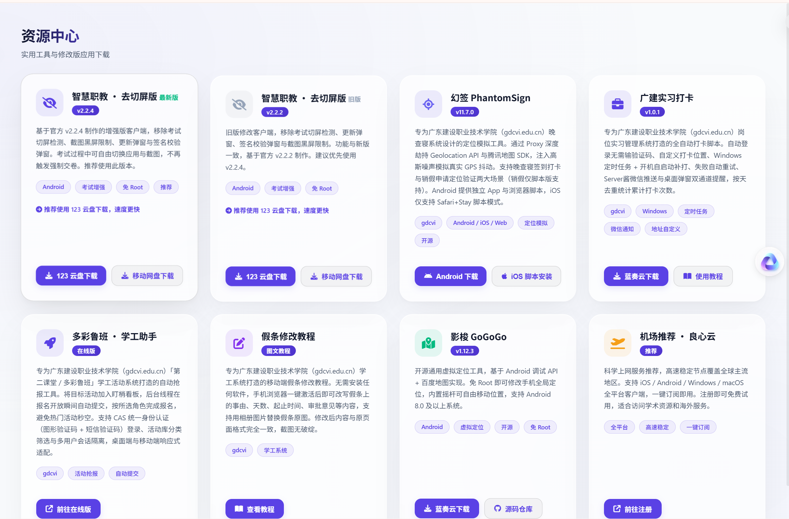
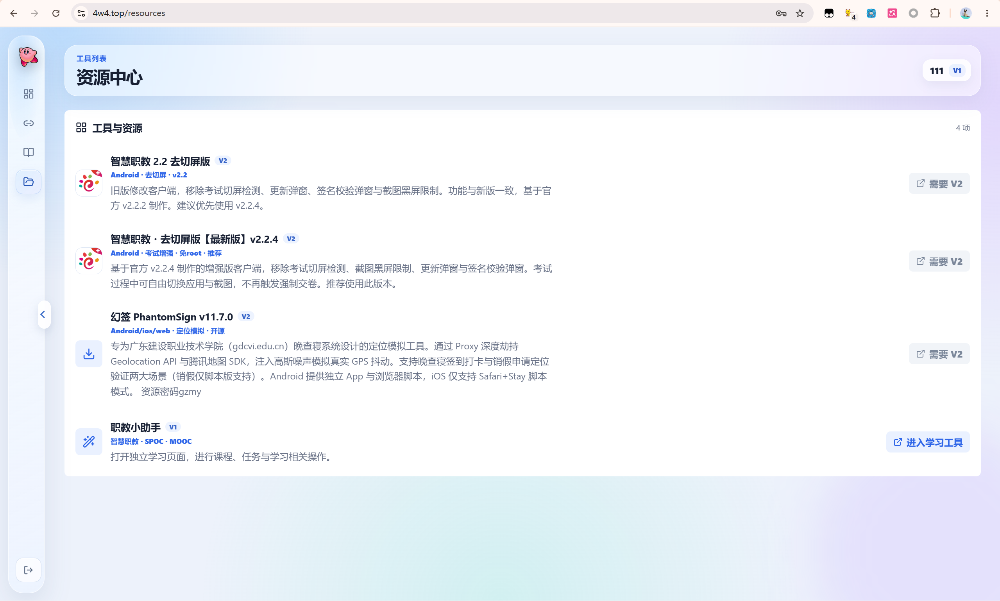

# ICVE_Toolkit

[](https://www.python.org/)
[](#快速开始)
[](./LICENSE)
[](https://github.com/atvkh/ICVE_Toolkit/releases)
[](https://github.com/atvkh/ICVE_Toolkit/stargazers)
[](https://github.com/atvkh/ICVE_Toolkit/forks)
[](https://github.com/atvkh/ICVE_Toolkit/issues)

> 本项目原为非公开的内部工具。因资源被盗取并用于商业牟利，经确认盗用者身份后，决定将核心功能完整开源。

## 目录

- [盗用事件](#盗用事件)
- [功能简介](#功能简介)
- [补签与改签](#补签与改签)
- [快速开始](#快速开始)
- [项目结构](#项目结构)
- [技术架构](#技术架构)
- [开源协议](#开源协议)

---

## 盗用事件

本项目付费资源(去切屏版、提取码、教程内容等)遭以下主体系统性盗取并用于商业牟利:

- **盗用平台**: `https://4w4.top/`
- **盗用仓库**: `https://github.com/xxxx773/ZJY-next`

**事实经过**:该方通过抓取本项目前端备份文件(`app.js.backup`)获取资源提取码及网盘下载链接，将资源原封不动复制至其平台，向用户收费提供。

**证据**:

1. **资源链接完全一致**:其平台展示的网盘下载链接及提取码与本项目中 `payment_config.py` 存储的链接完全相同，证明资源直接抓取自本项目。

2. **资源描述文案逐字抄袭**:其平台资源描述(如"幻签"功能说明等)与本项目中 `knowledge_base.json` 的文案逐字一致，包括错别字和排版。

3. **下载链接未更换**:其平台使用的移动网盘下载链接为本项目早期版本链接，本项目已轮换链接，但对方仍使用旧链接。

4. **聊天记录**:盗用行为被发现后，对方主动添加作者 QQ，言语挑衅，拒不承认盗用(见下方截图)。

5. **关联项目**:对方平台同时集成了作者另一开源项目 [幻签(PhantomSign)](https://github.com/atvkh/GDCVI-Geolocation-Hook-POC) 的功能。

| 聊天记录1 | 聊天记录2 |
|-----------|-----------|
|  |  |

| 本项目资源页面 | 盗用平台资源页面 |
|---------------|----------------|
|  |  |

鉴于此，本项目即日起完整开源，以正本清源。

> 原作者官方平台: [study.atvkh.xyz](https://study.atvkh.xyz)

---

## 功能简介

智慧职教(ICVE)课程自动完成工具，支持 SPOC / MOOC / 资源库三类课程的完整刷课、自动答题、补签与改签。

适用于职教云、智慧职教平台的课程学习辅助，涵盖刷课脚本、自动签到、考试答题、进度提交等功能。

### 核心功能

| 功能 | 说明 |
|------|------|
| 一键刷课 | SPOC/MOOC/资源库三类课程进度秒刷，支持快速模式和模拟真实模式 |
| 自动答题 | 自动抓取作业/考试/测验的正确答案并提交(资源库直取标准答案，MOOC/SPOC 同学答案+教师号+题库三级降级) |
| 自动讨论 | 课堂活动讨论、MOOC板块讨论、课件讨论自动回复 |
| 补签与改签 | 签到列表查询、单个/批量补签、代改考勤(详见下方) |
| 多账号管理 | 账号保存/切换/删除，Token 自动刷新 |

### 刷课范围

```
[1] 全部(进度 + 答题 + 讨论)
[2] 仅进度
[3] 仅讨论
[4] 仅答题
```

### 补签与改签

签到功能支持两类操作:

**补签(单个/批量)**:
- 自动查询最近 40 个课堂会话的签到活动
- 支持普通签到、手势签到、二维码签到三种类型
- 二维码签到优先读取签到详情的 qrCode 字段(已结束签到也能补)
- 一键补签所有未签到项，自动跳过已签到

**代改考勤**:
- 将已有签到记录修改为其他状态
- 支持的状态:已签到 / 迟到 / 请假 / 病假 / 事假
- 有记录时 PUT 更新，无记录时 POST 创建，PUT 失败自动回退 POST

签到状态说明:

| signResultType | 含义 |
|---------------|------|
| 0 | 未签到 |
| 1 | 已签到 |
| 2 | 迟到 |
| 3 | 请假 |
| 4 | 病假 |
| 5 | 事假 |

### 登录方式

浏览器手动登录 + 本地回调 Token:
1. CLI 启动本地 HTTP 服务(127.0.0.1:9527)
2. 浏览器打开 SSO 登录链接，手动完成验证码登录
3. 登录成功后自动回调，捕获 Token 完成认证
4. 账号信息持久化到 accounts.json

---

## 快速开始

### 环境要求

- Python 3.8+
- Windows / macOS / Linux

### 安装

```bash
git clone https://github.com/atvkh/ICVE_Toolkit.git
cd ICVE_Toolkit
pip install -r requirements.txt
```

### 运行

**Windows 双击启动**:直接双击 `start.bat`

**命令行启动**:
```bash
python main.py
```

### 使用流程

1. 选择 `[1] 登录`，浏览器打开链接完成登录
2. 选择 `[2] 查看我的课程`，确认课程列表
3. 选择 `[3] 一键刷课`，选择课程和刷课范围
4. 选择 `[4] 签到 / 改签` 进行补签或代改考勤

---

## 项目结构

```
ICVE_Toolkit/
├── main.py              # CLI 入口 + 交互式菜单
├── zjy_client.py        # API 客户端(三域鉴权 + 课程/刷课/签到/答题)
├── auth.py              # 登录(HTTPServer 回调 Token)
├── accounts.py          # 账号管理(JSON 存储)
├── speed_course.py      # 刷课(SPOC/MOOC/资源库 进度+答题+讨论)
├── answer.py            # 自动答题(答案抓取+提交)
├── sign.py              # 签到列表/补签/代改考勤
├── utils.py             # 日志/格式化工具
├── requirements.txt     # 依赖(requests + pycryptodome)
├── start.bat            # Windows 一键启动
├── LICENSE              # CC BY-NC-SA 4.0
└── docs/                # 证据图片
```

---

## 技术架构

### 三域鉴权

智慧职教有 4 个业务域，各域 Token 独立:

| 域 | 用途 | 鉴权方式 |
|----|------|---------|
| 主域 zjy2 | SPOC/MOOC 课程 | SSO Token → passLogin → Bearer Token |
| AI 域 ai | MOOC 课程设计/讨论/考试 | SSO Token → passLogin → X-AI-Token(401 自动重新鉴权) |
| 资源库域 zyk | 资源库课程 | SSO Token → passLogin → Bearer Token |
| SSO 域 sso | 单点登录 | 用户手动登录 |

### 答案数据源优先级

```
资源库: examRecordPaperList(服务端标准答案) > paper 接口 IsAnswer
MOOC/SPOC: 学生号直取 > 教师号预览 > 同学正确答案 > 题库兜底
```

### 刷课心跳机制

| 课程类型 | 心跳方式 | 特点 |
|---------|---------|------|
| SPOC | AES-128-ECB 加密 + 并发提交 | 服务器每次+5秒，batch=100 并发 |
| MOOC | 6个API探测 + 并发提交 | 服务器每次+5秒，heartbeat_interval=5 |
| 资源库 | 明文 JSON + 串行提交 | 服务器每次+10秒，URL 末尾斜杠必需 |

---

## 开源协议

**CC BY-NC-SA 4.0**(署名-非商业性使用-相同方式共享 4.0 国际)

- ✅ 允许:分享、改编、二次开发
- ❌ 禁止:商业使用(销售、付费服务、内部商业工具等)
- 📋 要求:署名原作者 + 衍生作品采用相同协议

详见 [LICENSE](LICENSE)。

---

## Keywords

智慧职教 | 职教云 | ICVE | zjy2.icve.com.cn | 刷课 | 秒刷 | 自动刷课 | 刷课脚本 | 自动答题 | 考试答题 | 作业答案 | SPOC | MOOC | 资源库 | 签到 | 补签 | 改签 | 代改考勤 | 签到改签 | 心跳提交 | 学习进度 | 课程进度 | icve speed course | 职教云刷课 | 智慧职教刷课 | 智慧职教签到 | 职教云签到 | 自动签到 | 课程秒刷 | 进度提交 | studyRecord
